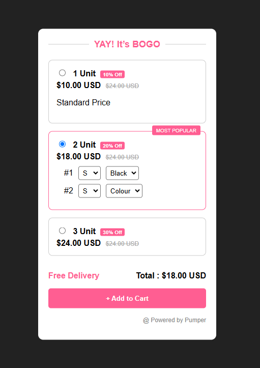

---

### 📄 `README.md`

```markdown
# 🛍️ BOGO Offer - Frontend Technical Support Task

This project is part of a technical screening task for a Frontend Technical Support position. The goal is to create a dynamic and interactive product selection page using only **HTML, CSS, and JavaScript (no libraries or frameworks)**.

---

## 📌 Features

- Responsive, mobile-friendly layout
- Three product selection boxes (1 Unit, 2 Units, 3 Units)
- Interactive box expansion on selection
- Customization options (size & color) loaded dynamically
- Highlighted "Most Popular" badge
- Total price updates based on selected unit
- Clean and reusable code structure

---

## 🚀 How to Run Locally

1. Clone the repository or download the ZIP.
2. Open `index.html` in your browser.
3. Interact with the boxes and test the selection functionality.

---

## 🧠 Technologies Used

- **HTML5** – for semantic structure
- **CSS3** – for custom styles and responsive design
- **Vanilla JavaScript** – for interactivity and dynamic DOM manipulation

---

## 📂 File Structure

```

BOGO-Offer/
├── index.html
├── style.css
├── script.js
└── README.md

```

---

## 📸 Preview



---

## 📬 Submission

Once complete, this project is to be:

- Hosted on [GitHub Pages](https://pages.github.com/) or [Netlify](https://www.netlify.com/)
- Shared with both the **repository link** and **live demo link**

---

## 📃 License

This project is submitted as part of a private technical screening and is not licensed for commercial use.
